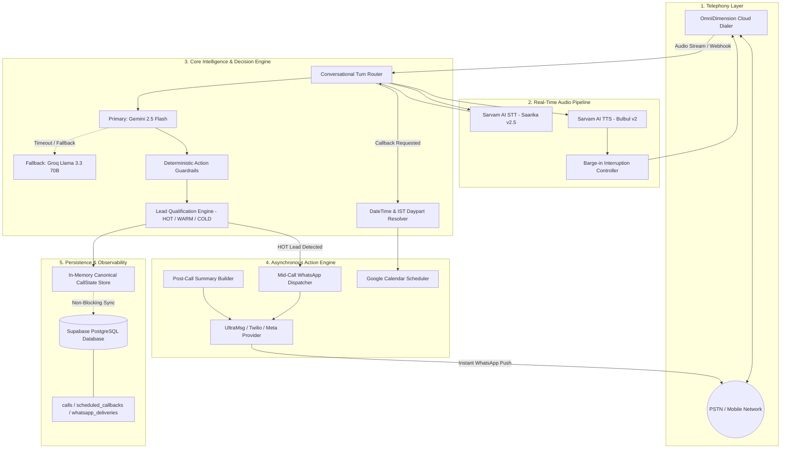

# ElevateVoice - System Architecture

ElevateVoice is an autonomous, multilingual, real-time conversational AI voice agent built for inbound/outbound sales discovery, qualification, mid-call action dispatch, natural language callback scheduling, and post-call CRM synchronization.

---

## 1. High-Level Architecture Diagram

---

## 2. Component Breakdown

### A. Telephony & Audio Pipeline
- **OmniDimension Cloud Dialer**: Manages SIP trunks, outbound automatic dialing, caller ID routing, and dual-channel telephony audio.
- **Sarvam AI STT (`saarika:v2.5`)**: Ultra-low latency multilingual speech recognition supporting English, Hindi, Telugu, and mixed code-switching (Hinglish/Telugish).
- **Sarvam AI TTS (`bulbul:v2`)**: Natural, human-like voice synthesis with sub-200ms TTFB.
- **Barge-in Interruption**: Real-time playback cancellation on user speech detection.

### B. Core Intelligence & Guardrails
- **Primary LLM (Gemini 2.5 Flash)**: High-speed structured JSON turn reasoning, consultative sales diagnosis, and intent scoring.
- **Secondary LLM (Groq Llama 3.3 70B)**: Active fallback engaged on Gemini timeout (12s limit) or rate limit.
- **Action Guardrails**: Enforces single-dispatch idempotency, prevents duplicate calendar events, and prevents hallucinated actions.

### C. Action Engine
- **Mid-Call WhatsApp**: Dispatches portfolio links and project confirmations while the caller is still on the phone.
- **Callback Engine**: Natural language IST daypart parser (*"tomorrow morning" -> 10:00 AM IST*, *"Monday afternoon" -> 02:00 PM IST*).
- **Post-Call Workflow**: Synthesizes verified conversation facts (products, catalog count, budget, timeline) without generic templates.

### D. Persistence Layer
- **In-Memory Store**: Sub-millisecond state mutations and idempotency locks during active phone calls.
- **Supabase PostgreSQL**: Live SSL connection pool with non-blocking `setImmediate` writes. Database failures never interrupt the live voice conversation.
